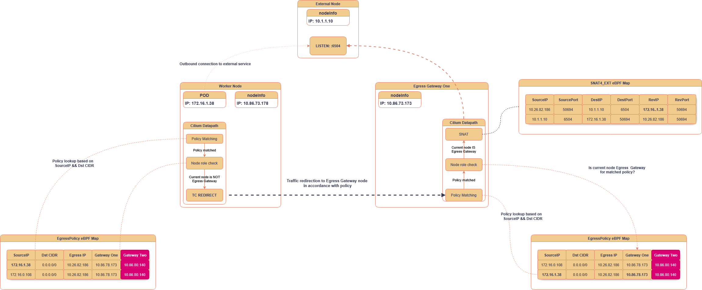

# Watershed

High-availability egress gateway synchronization for Cilium.

Watershed extends Cilium's eBPF datapath to support two active egress gateways with synchronized SNAT state. It replaces Cilium's built-in egress gateway control plane with its own, providing leader/follower failover, gRPC-based NAT state replication, and BGP egress IP advertisement.



## How It Works

1. An **eBPF fentry probe** intercepts updates to Cilium's `cilium_snat_v4_ext` LRU hash map
2. Events matching egress gateway policies are pushed to userspace via a **ringbuffer**
3. The **leader node** replicates SNAT entries to the follower over **gRPC** (`HandleUpdate` / `FullSync` RPCs)
4. Both nodes advertise egress IPs as /32 routes via **BGP** (leader prepends ASN twice, follower once — enabling asymmetric routing preference)
5. A **TCP prober** monitors gateway health and triggers failover events

Leader election is determined by IP address comparison in network byte order.

## Prerequisites

- Cilium v1.16.9 with the HA egress gateway patch applied (see `bpf/extra/`)
- `CiliumEgressGatewayPolicy` CRDs with a defined `egressIP` and valid interface
- Go 1.25+, clang (for BPF compilation)
- A BGP-capable upstream router

## Build

```bash
# Compile eBPF bytecode
clang -g -O2 -target bpf -I ./bpf -I ./bpf/include \
  -c ./bpf/ws/ws.c -o ./internal/bpfloader/bpfloader_x86_bpfel.o

# Build Go binary
CGO_ENABLED=0 go build -o ws ./cmd/ws/

# Generate protobuf/gRPC stubs
go generate ./...

# Run tests
go test ./...
```

### Docker

```bash
docker build -f deploy/docker/prod .   # production image
docker build -f deploy/docker/dev .    # debug image (Delve on :40000)
```

## Deployment

Watershed is deployed as a Kubernetes **DaemonSet** on egress gateway nodes via the Helm chart in `deploy/helm/`.

```bash
helm install watershed deploy/helm/ \
  --set image.registry=<registry> \
  --set image.repository=<repo>
```

### Configuration

All runtime configuration is provided via `ws.config.yaml` (delivered as a ConfigMap). There are no defaults — all fields must be explicitly set.

```yaml
logLevel: 4                    # slog log level
peerPort: 56453                # gRPC sync port
metricsPort: 9090              # Prometheus metrics port
terminationGracePeriod: 30s
tcpProbeInterval: 5s           # gateway health check interval
bgp:
  asn: 65450
  routerID: "10.0.0.1"
  holdTime: 3s
  keepaliveInterval: 3s
  connectRetry: 3s
  neighborList:
    - ip: "192.168.1.1"
      asn: 65735
      password: ""
```

### Required Capabilities

The DaemonSet runs with `hostNetwork` and `hostPID`, and requires: `CAP_NET_ADMIN`, `CAP_BPF`, `CAP_PERFMON`, `CAP_SYS_NICE`, `CAP_IPC_LOCK`, `CAP_FOWNER`, `CAP_DAC_OVERRIDE`.

Host mounts:
- `/sys/fs/bpf` — access to Cilium's pinned BPF maps
- `/proc/sys/net` -> `/host/proc/sys/net` — kernel sysctl tuning

## Project Structure

```
cmd/ws/                  Entry point (Cilium Hive DI)
bpf/ws/                  eBPF fentry probe and helpers
proto/                   gRPC service definition (ws.proto)
internal/
  ws/                    Core sync manager, gRPC client/server, metrics
  egressgateway/         CiliumEgressGatewayPolicy CRD watcher
  egressmap/             Cilium BPF policy map wrappers
  bgp/                   GoBGP-based egress IP advertisement
  bpfloader/             eBPF program loader
  prober/                TCP gateway health probes
  peermap/               BPF peer discovery map
  idallocator/           Read-only CiliumIdentity CRD allocator
  config/                ws.config.yaml schema and loader
  sysctl/                Kernel parameter tuning
  logs/                  slog JSON logger
  server/                HTTP server (metrics endpoint)
  link/                  Local IP detection via netlink
  debug/                 Call stack utilities
  defaults/              Shared constants
deploy/
  helm/                  Kubernetes Helm chart
  docker/                Production and debug Dockerfiles
bpf/extra/               Cilium HA egress gateway patches
doc/                     Architecture diagrams
```

## Cilium Patches

Watershed requires a patched Cilium. The patches are in `bpf/extra/`:

- `cilium.1.16.9.ha.egress.git.patch` — HA egress gateway implementation for Cilium 1.16.9
- `cilium.1.16.9.ha.egress.active-passive.egress_gateway_ha.h.override` — active-passive mode override

Tested against patched Cilium 1.16.3 and 1.16.9.

## Known Limitations

- Only `CiliumEgressGatewayPolicy` resources with a defined `egressIP` are supported. The egress interface is auto-selected from the default route.
- If both egress gateways fail simultaneously, existing TCP connections will hang even after a gateway is restored.

## Debugging

Set `WS_STARTUP_DELAY_SECONDS` to delay startup for debugger attachment. The dev Docker image runs Delve in headless mode on port 40000.

```bash
# Helm override for startup delay
helm install watershed deploy/helm/ --set startupDelaySeconds=30
```
